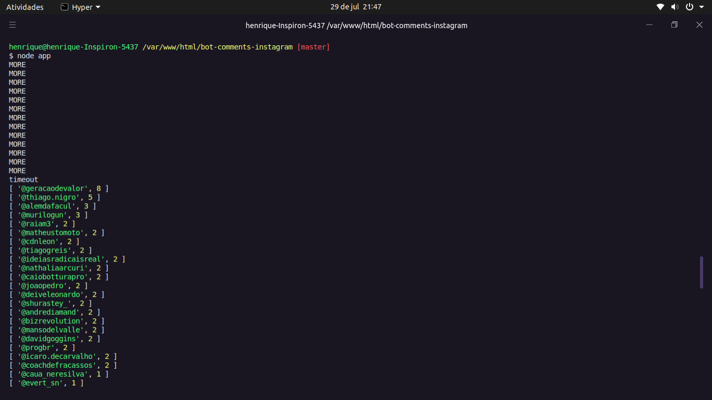

# BOT Comentarios do Instagram

Esse bot surgiu da necessidade de saber qual perfil do instagram foi o mais comentado

Foi desenvolvida como estudo de Node.js.

## Principais tecnologias utilizadas
- [puppeteer](https://www.npmjs.com/package/puppeteer) (O Puppeteer é uma biblioteca Node que fornece uma API de alto nível para controlar o Chrome ou o Chromium decapitado pelo Protocolo DevTools. Também pode ser configurado para usar Chrome ou Chromium completo;

## Como testar

Como pré-requisitos, é necessário instalar: 
[Node.js](https://nodejs.org/en/download/) e o

Com a aplicação instalada, abra o terminal ou prompt de comando (dependendo do sistema operacional utilizado) na pasta da aplicação. Em seguida, execute os seguintes comandos, em sequência:

```
npm install
node app
```

**Observação:** pode ser necessário utilizar `sudo` para instalar as dependências caso esteja usando Linux ou MacOS.

